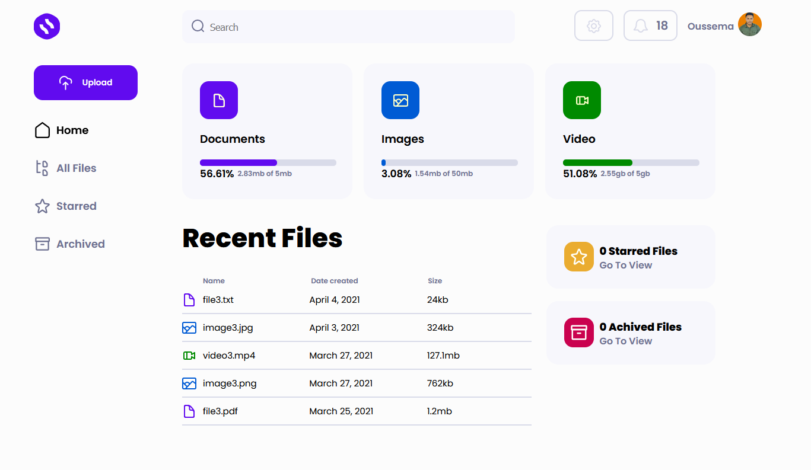
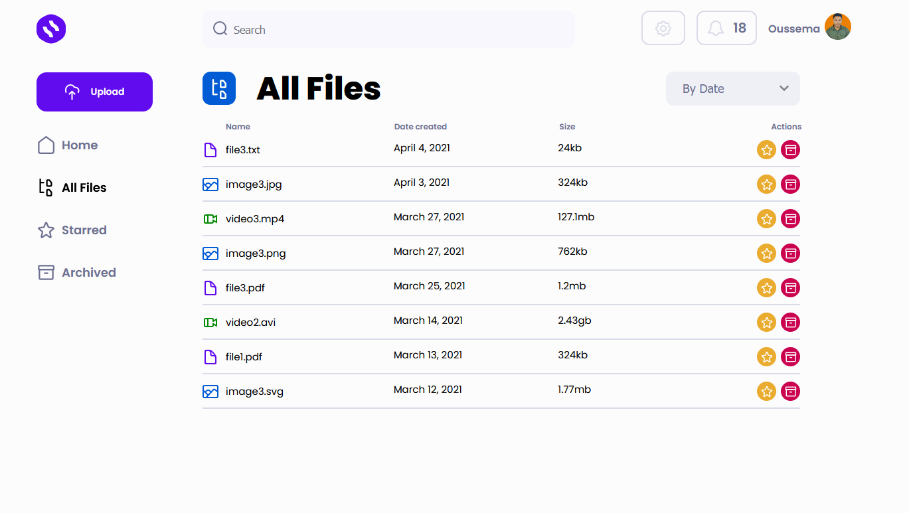
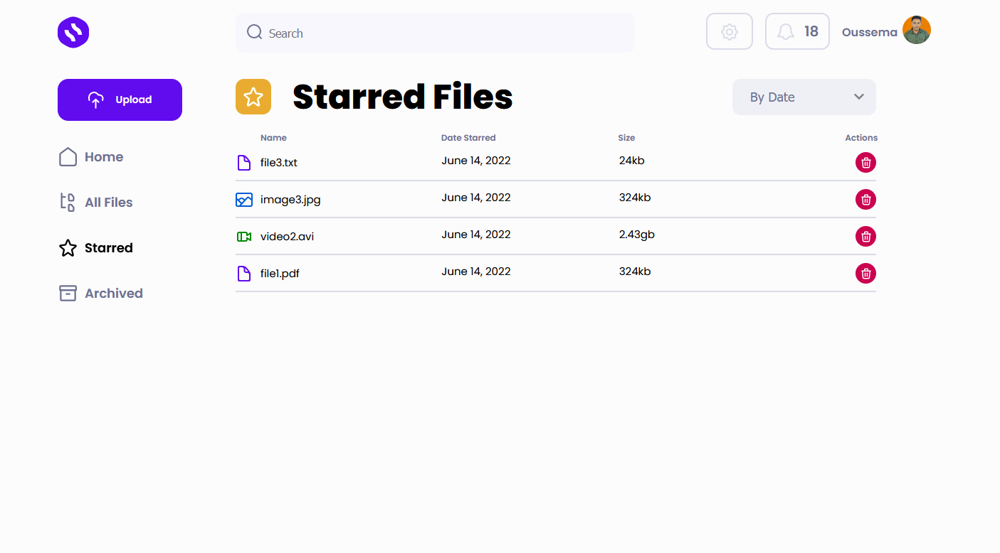
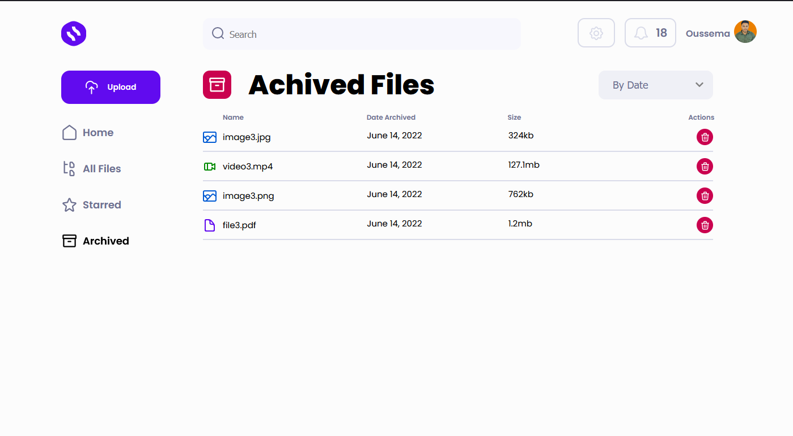

# File manger
you can upload files(images/video/file) and mange your files .

## 🔗 Link

```bash
https://file-manger-ff7f6.web.app/
```
## App Photo





## Quick run

```bash
git clone https://github.com/oussemaIbrahim/file-manger.git file-manger
cd file-manger/
npm install
npm start
```
## 🛠 Skills
Javascript, HTML, css

## Tech Stack
React ,Redux ,Scss 